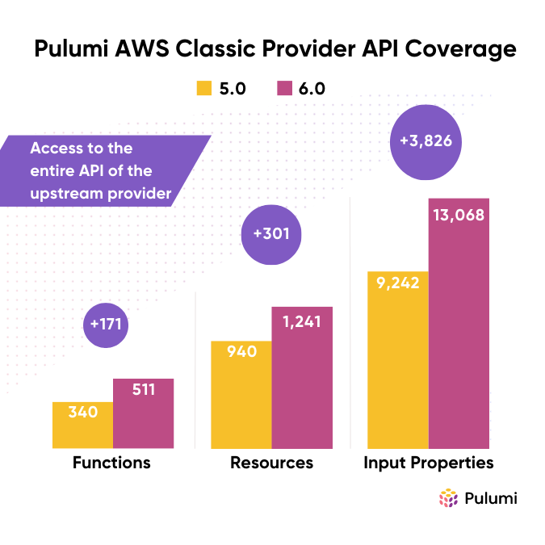
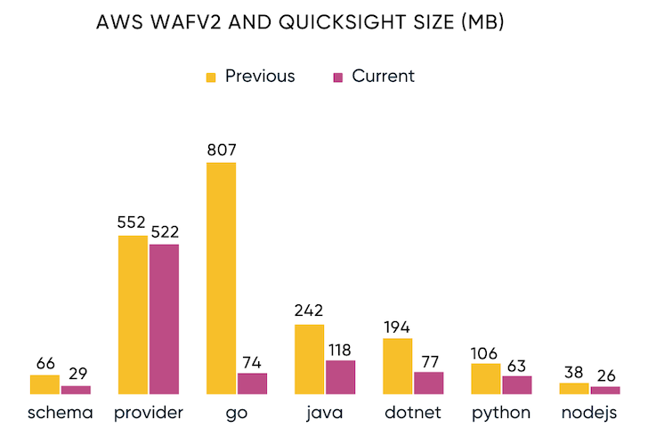

We are excited to announce 6.0 of the [Pulumi AWS Classic provider](https://www.pulumi.com/registry/packages/aws/). The AWS Classic provider is the most heavily used provider across the entire Pulumi ecosystem, and offers access to the full surface area of the upstream Terraform AWS Provider in Pulumi projects in all supported languages. The [6.0 release](https://github.com/pulumi/pulumi-aws/releases/tag/v6.0.2) brings a substantial set of fixes and improvements to the provider, including a number of breaking changes as part of the major version release.

This blog post walks you through the list of notable changes in the new major version.

<!--more-->

{}
Join Pulumi on Thursday, September 7, 2023 for a live workshop on [getting started with infrastructure as code on AWS](/resources/getting-started-with-iac-pulumi-aws/), which will feature the new AWS 6.0 provider.
{}

### Terraform Plugin Framework Support

More and more Terraform resources are migrating to the [Terraform Plugin Framework](https://developer.hashicorp.com/terraform/plugin/framework). We are excited to announce that 6.0 supports all resources implemented with both the new Terraform Plugin SDK and the legacy Terraform Plugin Framework technologies. This means that you get access to the entire API of the upstream provider.

### New Resources and Functions

Since the previous major release of 5.0, we have shipped 57 additional minor and patch releases, enabling you to keep up with the latest and greatest enhancements. The new major version of the AWS Classic provider brings 56 new resources and 23 new functions. Additions include resources for Audit Manager, Chime, Fin Space, Global Accelerator, Open Search, Quicksight, Resource Explorer, Route53, Transfer, and many other AWS services.

You can see a full list of new resources and functions in [Release Notes](https://github.com/pulumi/pulumi-aws/releases/tag/v6.0.0).

### SDK Size Optimization

The AWS Classic provider contains more than 1,200 resources with over 12,000 properties between them. As a result, it’s expected that the SDK size of the provider has grown to be fairly large. With that in mind, we invested in some key areas to reduce the size of generated files. Depending on the runtime, the SDK is now up to 90% smaller than it used to be in v5 of the provider!

One particular optimization is related to `wafv2` resources, that were particularly difficult to use in Pulumi AWS v5 (issue [one](https://github.com/pulumi/pulumi-aws/issues/2276), [two](https://github.com/pulumi/pulumi-aws/issues/1117), [three](https://github.com/pulumi/pulumi-aws/issues/2250)). The new release includes a refactored `wafv2` module which uses recursive types. Using recursive types allowed us to remove a lot of excess generated code.

Smaller SDK sizes mean faster downloads, snappier experience with editors and code completion tools, less time needed for `pulumi preview` and `pulumi up` operations, and smaller binaries, all of which contribute to a streamlined developer experience for Pulumi users.

### Upstream Breaking Changes

Pulumi AWS Classic 6.0 ships all improvements and bug fixes of upstream versions from 5.0.0 to 5.11.0. It also contains a number of upstream breaking changes. Please refer to the [changelog](https://github.com/hashicorp/terraform-provider-aws/blob/main/CHANGELOG.md) to navigate the entire list.

### Fixes for Highly Upvoted Issues

The new release ships fixes for many [highly upvoted issues along with Pulumi-specific enhancements](https://github.com/pulumi/pulumi-aws/issues?q=label%3A6.0+sort%3Areactions-%2B1-desc+-label%3Akind%2Ftask+-label%3Akind%2Fepic+is%3Aclosed). This includes resolving [constant diff from wafv2 with no changes](https://github.com/pulumi/pulumi-aws/issues/1423) and [unexpected behavior of defaultTags](https://github.com/pulumi/pulumi-aws/issues/1655) that have been fixed and are available in the new release.

### MaxItemsOne and Deprecations

The 6.0 release removed a few resources that have been deprecated for a long while. All of those resources were replaced with newer versions containing a more logical organization of modules and resource names. The old resources have been deprecated for years, so it's unlikely that you were still using them. But in case you do, we applied automatic aliases to make migration as straightforward as possible.

We also shipped a few, small breaking changes to properties that may allow one or many items. We aligned those with the capabilities of the upstream provider and the AWS services ensure Pulumi users can access the full capabilities of the platform.

You can see a full list of changes and learn more about migrating your existing programs in our [Migration Guide](https://www.pulumi.com/registry/packages/aws/how-to-guides/6-0-migration).

### Get Started Today

You can browse our [API reference docs](https://www.pulumi.com/registry/packages/aws/) with inline examples or explore the [Pulumi AWS Classic Provider](https://github.com/pulumi/pulumi-aws) repository to get started today! And don't forget [to register for the live workshop](/resources/getting-started-with-iac-pulumi-aws/) on September 7, 2023 to see AWS 6.0 in action!
